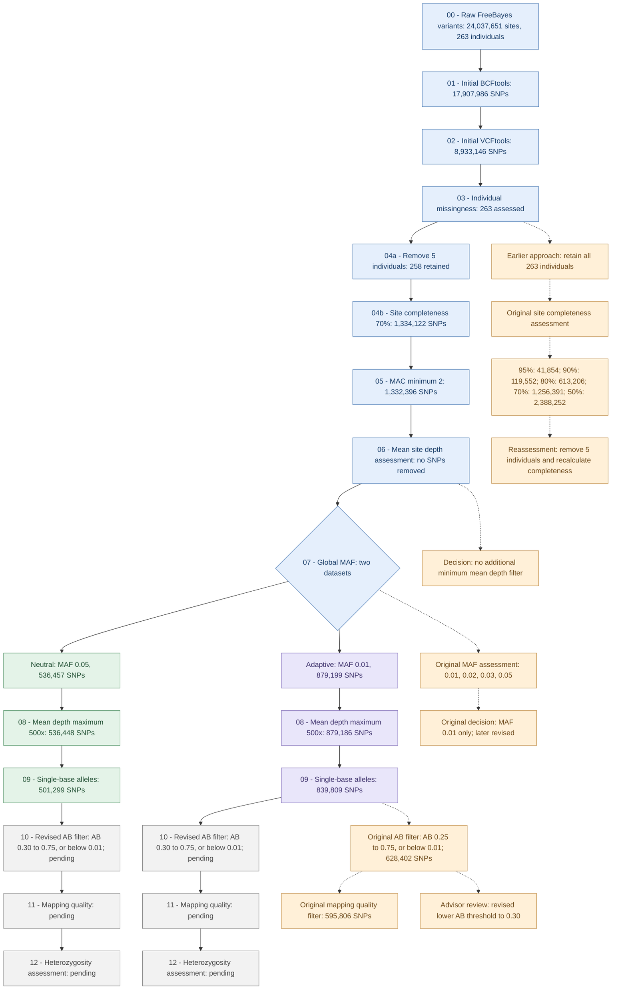

```mermaid
flowchart TD
    RAW["00 - Raw FreeBayes variants: 24,037,651 sites, 263 individuals"]
    BC["01 - Initial BCFtools: 17,907,986 SNPs"]
    VC["02 - Initial VCFtools: 8,933,146 SNPs"]
    IND["03 - Individual missingness: 263 assessed"]
    REM["04a - Remove 5 individuals: 258 retained"]
    SITE["04b - Site completeness 70%: 1,334,122 SNPs"]
    MAC["05 - MAC minimum 2: 1,332,396 SNPs"]
    DEP["06 - Mean site depth assessment: no SNPs removed"]
    SPLIT{"07 - Global MAF: two datasets"}

    RAW --> BC
    BC --> VC
    VC --> IND
    IND --> REM
    REM --> SITE
    SITE --> MAC
    MAC --> DEP
    DEP --> SPLIT

    IND -.-> IOLD["Earlier approach: retain all 263 individuals"]
    IOLD -.-> M263["Original site completeness assessment"]
    M263 -.-> THR["95%: 41,854; 90%: 119,552; 80%: 613,206; 70%: 1,256,391; 50%: 2,388,252"]
    THR -.-> REASSESS["Reassessment: remove 5 individuals and recalculate completeness"]

    DEP -.-> DNOTE["Decision: no additional minimum mean depth filter"]

    SPLIT --> N7["Neutral: MAF 0.05, 536,457 SNPs"]
    SPLIT --> A7["Adaptive: MAF 0.01, 879,199 SNPs"]

    SPLIT -.-> MALT["Original MAF assessment: 0.01, 0.02, 0.03, 0.05"]
    MALT -.-> MDEC["Original decision: MAF 0.01 only; later revised"]

    N7 --> N8["08 - Mean depth maximum 500x: 536,448 SNPs"]
    A7 --> A8["08 - Mean depth maximum 500x: 879,186 SNPs"]

    N8 --> N9["09 - Single-base alleles: 501,299 SNPs"]
    A8 --> A9["09 - Single-base alleles: 839,809 SNPs"]

    N9 --> N10["10 - Revised AB filter: AB 0.30 to 0.75, or below 0.01; pending"]
    A9 --> A10["10 - Revised AB filter: AB 0.30 to 0.75, or below 0.01; pending"]

    A9 -.-> ABOLD["Original AB filter: AB 0.25 to 0.75, or below 0.01; 628,402 SNPs"]
    ABOLD -.-> MQOLD["Original mapping quality filter: 595,806 SNPs"]
    ABOLD -.-> ABREV["Advisor review: revised lower AB threshold to 0.30"]

    N10 --> N11["11 - Mapping quality: pending"]
    A10 --> A11["11 - Mapping quality: pending"]

    N11 --> N12["12 - Heterozygosity assessment: pending"]
    A11 --> A12["12 - Heterozygosity assessment: pending"]

    classDef shared fill:#e5effc,stroke:#4777b2,color:#173b67
    classDef neutral fill:#e4f3e8,stroke:#3d8655,color:#225034
    classDef adaptive fill:#e9e6fa,stroke:#7863b2,color:#3c306b
    classDef history fill:#fff0d8,stroke:#bd873e,color:#6d481a
    classDef pending fill:#f2f2f2,stroke:#888,color:#444

    class RAW,BC,VC,IND,REM,SITE,MAC,DEP,SPLIT shared
    class N7,N8,N9 neutral
    class A7,A8,A9 adaptive
    class IOLD,M263,THR,REASSESS,DNOTE,MALT,MDEC,ABOLD,MQOLD,ABREV history
    class N10,A10,N11,A11,N12,A12 pending
```
